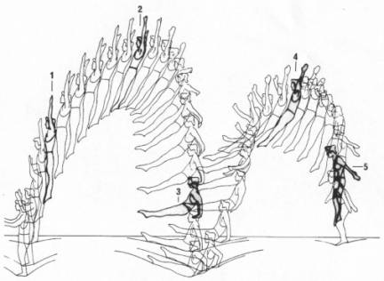

Grundsprünge und Landungsarten
==============================

Im Folgenden sollen die Basissprünge auf dem Trampolin vorgestellt werden. Nach einer kurzen **Bewegungsbeschreibung** erfolgt dann eine Übersicht über die Schritte, die ein **methodischen Erlernen** des Sprunges ermöglichen. Normalerweise sollte die Reihenfolge der Schritte eingehalten werden. Es ist jedoch möglich und sinnvoll, einzelne Schritte, je nach Können und Lernfortschritt des Aktiven, auszulassen.

Die Sprünge werden hier in fünf Kategorien aufgeteilt. Zuerst die Fußsprünge Hocksprung (**Hocke**), Bücksprung (**Bücke**) und Grätschwinkelsprung (**Grätsche**). Weiter geht es mit Sprüngen in denen eine Schraubenbewegung ausgeführt wird: Standsprungschraube (**½ Schraube**, **ganze Schraube**). Danach folgen die drei weiteren Landungsarten, die möglich sind: Sitzlandung, Rückenlandung und Bauchlandung (aka. **Sitz**, **Rücken**, **Bauch**). Im Folgekapitel :doc:`sprungverbindung` geht es um die Verbindungen der Landungsarten mit Schrauben wie z.B. **½ Schraube zum Sitz**.

Falls der Sport vom Aktiven länger betrieben werden will, ist es wichtig früh auf Fehler in der Ausführung einzugehen, da sich Bewegungen relativ schnell im Kopf verfestigen. Es braucht jedoch viele Wiederholungen bis etwas falsch gelerntes wieder abgewöhnt ist (Erfahrungswert zur Relation der Wiederholungen: 7 zu 35). Bei der Korrektur am Gerät sollte man sich entscheiden auf die Hauptfehler einzugehen oder besser die **Fehler chronologisch abzuarbeiten**, da viele Ausgleichsbewegungen oft nur Folgefehler sind.

.. rubric:: Ausführungsformen

Zur Variation der Schwierigkeit lassen sich die Grundsprünge hinsichtlich der Komplexität und Qualität abstufen nach grober Ausführung, fein- und Feinstform. Die **grobe Ausführung** lässt die Arme unbeachtet. Diese können entweder gestellt oder am Körper angelegt bleiben. Am Beispiel des Hocksprungs werden demnach nur die Beine angehockt und der Oberkörper zum Ausgleich vorgelagert. Bei der **Feinform** gibt es einen vereinfachten Armeinsatz. Ausgehend von den gestellten oder angelegten Armen tippen die Hände im Beispiel der Hock kurz die Knie an und gehen danach zurück in ihre Ausgangsposition. Die **Feinstform** hat vollen Armeinsatz und erfordert eine gewisse Sprunghöhe, Geschwindigkeit und Übung. Die Beschreibung der Feinstform für die Hocke befindet sich im nächsten Abschnitt.

..
    TODO bilder der phasen finden

Fußsprünge
-----------

Bei allen Landungen auf den Füßen sind diese im Tuch ein wenig geöffnet, um eine bessere Standfähigkeit zu ermöglichen. Der Abdruck aus dem Tuch erfolgt hauptsächlich mit den Fußballen, mit geringerer Unterstützung der Arme. Die Arme sind beim Absprung grundsätzlich **gestellt** (s.o.). Direkt nach dem Absprung werden die Füße geschlossen. Alle Fußsprünge beginnen zuerst mit einem gestreckten Sprung in die Höhe. Die eigentliche Bewegung wird erst **nach dem Absprung** eingeleitet, wenn die Füße das Trampolin verlassen haben. Das ermöglicht ein Springen auf der Stelle. Die Füße und Zehen sind in der Luft möglichst getreckt.

.. rubric:: Bewegungsbeschreibung

- Bei der **Hocke** werden die Beine gehockt nach vorne zum Oberkörper geführt. Die Hände fassen dabei die Knie knapp unterhalb der Kniescheiben an. Der Oberkörper ist leicht nach vorne gebeugt.
- Bei der **Bücke** werden die Beine gestreckt nach oben in die Waagerechte geführt. Die Hände fassen hierbei von oben auf den Fußrücken. Der Oberkörper befindet sich möglichst nahe an den Oberschenkeln. Gefordert ist ein Winkel von deutlich weniger als 90 Grad zwischen Oberkörper und Oberschenkel.
- Die **Grätsche** verläuft wie die Bücke. Bloß werden hierbei die gestreckten Beine in der Luft mindestens 90 Grad weit gespreizt.
- Die Landung erfolgt jeweils mit wieder gestellten Armen.

.. rubric:: Feinstform - Hocke

- Absprung, Arme starten in gestellter Haltung
- In der Steigphase wird die Hocke eingeleitet
- Hände bewegen sich zur Hocke und greifen den Oberschenkel dicht unter den Knien
- Die Hockposition ist klein, Knie berühren die Brust, Beine sind geschlossen
- In der Phase des Fallens, bzw. nach kurzem stabilem Halten, wird die Hock-Position wieder aufgelöst
- beim Auflösen der Hocke bewegen sich die Arme mit den Beinen, bzw. unterstützen die Öffnung
- nach der Öffnung liegen die Arme eng am Körper, Hände leicht seitlich auf dem Oberschenkel
- kurz vor dem Tuchkontakt bewegen sich die Arme wieder in die gestellte Haltung

Diese Sprünge lassen sich normalerweise von Anfängern ohne große Hilfe erlernen. Als "Vorübung" können die Teilnehmenden die Bewegung anfangs nur Andeuten und innerhalb weniger Wiederholungen intensivieren bis zum vollen Sprung. Es sollte darauf geachtet werden, dass die Landung möglichst aufrecht und nicht mit Vor- oder Rücklage erfolgt. Ein Indikator für den Trainer ist eine starke Asymmetrie während der Ausführung des Sprungs (z.B. Oberkörper bleibt aufrecht). Eventuell sollte die Landung durch den Trainer auf dem Tuch zu Beginn unterstützt werden.

.. tip::
    Hocke und Grätsche sind leichter erlernbar und für den Anfang ausreichend. Das Erlernen der Bücke kann auch zu einem späteren Zeitpunkt - beispielsweise nach dem Rückensprung - erfolgen.

Schraubensprünge
-----------------

Schrauben haben beim Trampolinturnen eine nicht unwesentliche Bedeutung. Erlauben sie doch, besonders später in Verbindung mit den Salti, eine viele größere Variation der Sprünge (Salto vw., Salto vw. mit ½-Schraube, Salto vw. mit 1½-Schrauben ...) auf dem Trampolin.

Es gibt verschiedene Techniken eine Schraubenbewegungen für Standschrauben in der Luft auszuführen. Die eine ist recht intuitiv (aber nicht einfach genau dosiert) ausführbar: die Schraubenbewegung wird schon im Tuch durch ein Drehen des Körpers in die gewünschte Richtung eingeleitet. Die zweite und bevorzugte Technik funktioniert indem man die Schulter-Seite entsprechend der gewünschten Drehrichtung nach hinten aushebt und die Gegenseite nach vorne Kippt. Der Kopf unterstützt die Drehrichtung. In späteren Saltoschrauben wird daraus die asymmetrische Armbewegung.
Wasserspringer verwenden noch eine weitere Schraubentechnik - sie führen eine Hula-Hoop-Bewegung in der Luft aus - zusätzlich kann eine Scherenbewegung der Beine zusätzliche Rotation erzeugen.

.. rubric:: Schraube aus dem Tuch

Bei den Sprüngen des Anfängerbereichs handelt es sich meist um **im Tuch eingeleitete Schraubenbewegungen**. Folgende Hinweise sind hilfreich, um mit Aktiven das Schrauben auf dem Trampolin zu üben:

- im Tuch (in der Steigphase) eingeleitete Schrauben müssen so dosiert sein, dass im höchsten Punkt des Sprungs die Hälfte der gewünschten Schraubenmenge erreicht ist
- je mehr der Körper gestreckt ist, desto schneller erfolgt die Schraubendrehung (wichtig: Arme dicht am Körper); Übung: Standsprungschraube mit zur Seite gehaltenen Armen springen, in der Luft die Arme an den Körper heranziehen: die Schraube wird schneller
- erst auf genügendes Steigen aus dem Tuch achten; eventuelle Saltobewegungen werden ebenfalls noch vor der Schraubenbewegung eingeleitet
- es kostet bis zu zehnmal mehr Kraft einen gestreckten Salto auszuführen, als dies bei einer ganzen Schraube der Fall ist
- Vorsicht! Je mehr Schraubenimpuls „mitgegeben“ wird, desto mehr ist davon auch im Tuch noch vorhanden; Spannung halten und die Beine zusammendrücken, damit sich die Knie nicht verdrehen.

.. rubric:: Methodische Übungsreihe

- Sprung mit seitlich ausgestreckten Armen (T-Form), halbe Schrauben vor und zurück
- sobald das stabil funktioniert, nach einer viertel Schraube die Arme an den Körper nehmen (der eine Arm im Bogen, der andere dicht an den Körper) und damit die Schraube beschleunigen, zum Verlangsamen / Stoppen die Arme wieder ausstrecken
- Übung mit gestellten Armen wiederholen - der Schraube ist direkt schneller und kann nur verlangsamt werden

Beim Trampolinturnen sollte **eine Drehrichtung** vom Aktiven **eingehalten** werden. Wie beim Schreiben auch, gibt es Vorlieben für das Drehen nach rechts oder links. In welche Richtung der Turner sich dreht, ist egal; wichtig ist bloß, dass er eine einmal „ausgesuchte“ Drehrichtung bei allen Schrauben später beibehält. Bei Demonstrationen sollte man gerade bei kleinen Kindern darauf achten, deren Drehrichtung zu „benutzen“, um nicht durch einen „Nachmach-Effekt“ eine falsche Drehrichtung des Aktiven zu bewirken.

.. rubric:: Schraube in der Luft - Bewegungsbeschreibung

- Absprung zum Strecksprung
- eine Schulter-Seite wird entsprechend der Drehrichtung nach hinten ausgehoben, die Gegenseite kann nach vorne bewegt werden
- der Kopf unterstützt die Bewegung in Drehrichtung
- die Arme können zunächst am Körper anliegen, gestellt sein oder später die asymmetrische Schraube aktiv unterstützen:

  - der Arm in Schaubenrichtung unterstützt das Ausheben der Schulter und wird dabei nach hinten herunterführt - Ziel ist das Gesäß - allerdings bleibt der Arm relativ durch die Schraube seitlich vom Springer
  - der andere Arm wird über die Vorseite heruntergeführt - Ziel ist der diagonale Hüftknochen

Sitzlandung / Sitz
------------------

Die erste wichtige Landungsform nach den Füßsprüngen ist der Sitz. Der Name wirkt unscheinbar, aber es versteckt sich in der Ausführung schon die Grundtechnik für spätere Rückensprünge bzw. Saltis. Daher lohnt es sich den Fokus schon früh auf saubere Ausführung zu legen.

.. _TechnikSalto:
.. rubric:: Technik - Saltorotation rückwärts

Auch wenn hier von einem Salto gesprochen wird, wird diese Technik bereits für Sitz- und Rückensprung benötigt. Das Aufbauen der Saltorotation beginnt nach dem Absprung mit einer Vorspannung des Körpers. Dabei wird die Hüfte gekippt. Als Analogie kann man sich vorstellen, dass man eine Gürtelschnalle (bzw. den Bauchnabel) in den Bauch einziehen möchte. Oberschenkel und Hüfte bewegen sich dabei leicht nach vorne und es entsteht eine Vorspannung (C-Minus). Nach Aufbau der Spannung erfolgt der Wechsel von C-Minus ins C-Plus, d.h. ein Kick mit den Beinen und sofortiges Abstoppen in leichter Schiffchenposition (Po-Muskel arbeitet). Mit gewisser Intensität ist diese Bewegung ausreichend für den gestreckten Rückwärtssalto. Im Folgenden wird diese Technik abgekürzt mit **"Vorspannung und Kick"** beschrieben.
Als Vorübung eignet sich der Mattenkick:
Der Aktive stellt sich 1cm vor eine relativ hohe und schwere Matte (sie sollte sich nicht Bewegen bei der Übung), springt mit gestellten Armen ab, spannt den Körper und benutzt den Kick um die Matte mit dem Fußspann zu treten. Abschluss ist eine Landung auf den Füßen. Bei richtiger Ausführung gerät der Aktive nach dem Abprallen des Kicks deutlich in Vorlage.

    Phasen eines Sitzsprungs, Quelle: http://heiny.info/uni/sport/phasentrampolin.html

.. rubric:: Bewegungsbeschreibung

- Ziel: Stand - Sitzlandung - Aufstehen in den Stand
- im Absprung Körper spannen und Fußkick ausführen, so dass eine leichte Rücklage des gestreckten Körpers im höchsten Punkt erreicht wird, Beine sind geschlossen
- Arme getreckt neben den Ohren halten
- in der 2. Sprungphase (fallende Phase vom oberen Umkehrpunkt bis zur Landung) die Arme seitlich nach unten führen
- kurz vor der Landung die Hüfte beugen, die Beine sollten gleichmäßig zum Liegen kommen; Tip: mit der Intensität kann für geübte Springer eine Nachjustierung erfolgen - zu wenig Rotation kann durch eine schnelle Beinbewegung kompensiert werden (und umgekehrt)
- **Sitzposition**: bei der Landung die Hände neben bzw etwas hinter dem Gesäß abstützen, die Finger zeigen dabei geschlossen nach vorne, der Oberkörper ist bei geradem Rücken leicht nach hinten geneigt, die Beine geschlossen und wie die Zehen gestreckt
- Aufstehen zum Stand:

  - mit den Händen aktiv abdrücken
  - Arme getreckt und schwungvoll über Vorderseite hoch führen
  - die Hüfte nach vorne oben schieben (Öffnung des Hüftwinkels)

.. rubric:: Methodische Übungsreihe

- Demonstration; besonders die Landeposition verdeutlichen
- Sitzposition statisch auf dem Tuch einnehmen
- aus dem Wippen den Körper vorspannen und Beine nach vorne schieben, zusätzlich die Arme nach oben führen
- Sprunghöhe immer weiter steigern

.. rubric:: Häufige Fehler

- Beine und Hüfte werden nicht genug oder zu sehr nach vorne geschoben (Po- oder Rücklage)
- die Hände stützen den Oberkörper in der Landung nicht ab (Staucht den Rücken)
- die Beine sind nicht gestreckt
- Arme werden nicht hochgeführt beim Aufstehen (Aktive kommen in Vorlage zum Stehen)

.. rubric:: Hilfestellung

- seitlich leicht vor dem Aktiven stehen, so lässt das Gesicht im Blick behalten
- eine Hand befindet sich nahe der Wirbelsäule auf Höhe der Schulterblätter um ein Überdrehen zu verhindern
- die zweite Hand kann auf der Schulter ruhen und den Sprung stabilisieren

Rückenlandung / Rücken
----------------------

Der Rückensprung bereitet Anfängern erfahrungsgemäß oft erst einmal Probleme. Zu unbekannt ist das Gefühl, rückwärts nach unten zu fallen. Zusätzlich ist die Bewegung recht komplex; es müssen viele kleine Bewegungen fast zur gleichen Zeit kontrolliert ausgeführt werden. Aus diesem Grund ist es sinnvoll, die Rückenlandung mit einigen Übungen vorzubereiten, und das auch schon einige Zeit, bevor der Sprung überhaupt gelernt werden soll.

.. rubric:: Bewegungsbeschreibung

- Ziel: Stand - Rückenlandung - Aufstehen in den Stand
- im Absprung Körper spannen und gemäßigten Fußkick ausführen (siehe Technik vom Sitzsprung), sodass der gestreckte Körper sich während des Sprungs bis annähernd in die Waagerechte bewegt
- die Arme unterstützen den Absprung nach oben - sie sind gestellt und zeigen während des Sprungs weiterhin zur Decke
- vor der Landung die Hüfte einknicken, so dass im Tuch die Beine senkrecht zur Decke stehen und der gesamte Rücken gleichmäßig zum Liegen kommt
- Tip: wie schon beim Sitzsprung beschrieben, ermöglicht eine Variation der Intensität des Hüftschlags die Nachjustierung des Sprungs
- die Arme befinden sich bei der Landung ebenfalls gestreckt senkrecht zur Decke zeigend
- **Liegeposition**: Seitlich betrachtet nimmt der Körper im Tuch eine "Wannenform" ein, d.h. keine rechten Winkel, sondern etwas mehr geöffnet in Hüfte und Schulter - der Kopf kann auf dem Trampolin abgelegt werden
- Absprungposition der Füße (auf Kreuz) sollte in Rückenlage auch Position des Bauchnabels sein (Fixpunkt)
- Aufstehen zum Stand:

  - die Schulter drückt bei der Aufwärtsbewegung nochmal ins Tuch
  - Füße werden zur Decke gestreckt
  - in der Flugphase schlägt der Aktive den Hüftwinkel auf um in den Stand zu gelangen, der Körper ist wieder komplett getreckt
  - bei richtiger Ausführung gelingt eine Landung auf der Stelle (zurück aufs Kreuz)

.. rubric:: Methodische Übungsreihe

- Mattenkick bei Erwärmung üben, siehe :ref:`Technik-Abschnitt im Sitz-Kapitel <TechnikSalto>`
- Demonstration; Insbesondere auf die Position der Beine und Arme bei der Landung sollte eingegangen werden
- Liegeposition statisch auf dem Tuch einnehmen
- Stempelgriff-Vorübung zum Kennenlernen der Landephase: Trainer greift die Füße aus der Trockenposition und federt den Aktiven mit einem Kick ins Tuch. Dieser versucht mit dem Oberkörper in der Luft waagerecht zu bleiben
- Tip: für eine Reduktion der Komplexität können die nachfolgenden Übungen zunächst in den flachen (bzw. platten) Rücken durchgeführt werden
- auf einer sehr weichen oder gefederten Matte (Mattentisch bzw. Geräteaufbau unten beschrieben) den Absprung auf der Matte und die Landung im Rücken üben
- Geräteaufbau - kann parallel zum Training auf dem Trampolin benutzt werden

  - zwei Turnbänke parallel stellen, darauf einen Weichboden (je nach Mattenhärte Abstand der Bänke variieren).
  - Seile verhindern ein Auseinanderrutschen der Bänke.
  - auch möglich: ohne Bänke, nur Weichboden und darauf eventuell eine Schiebematte

- auf dem Trampolin: Schiebematte in die Mitte des Trampolins legen und wie vorher zum Rücken springen
- gleiche Übung, stärker abspringen
- die Matte aus dem Tuch nehmen und schieben und/oder Hilfestellung anbieten
- Maikäfer - aus Ruheposition in Rückenlage selbstständig Höhe gewinnen, Hüftwinkel variiert in verschiedenen Höhen um im Rücken zu bleiben, Arme halten Gleichgewicht

.. rubric:: Häufige Fehler

- **Wichtig**: die Teilnehmer sollten niemals zum Selbstschutz die Arme nach unten bringen um sich abzufangen - stattdessen sollen sie sich klein machen (Päckchen) und durch die Schiebematte gebremst werden
- zu wenig Schwung, infolge dessen die Hüfte zu früh angewinkelt wird, um noch auf dem Rücken zu landen
- die Beine sind in der Landung nicht optimal gestellt; Folgen:

  - zu tief -> die Beine fallen auf das Tuch, der Sprung ist zu flach, Stehauf-Männchen-Effekt mit deutlichem Vorwärtswandern in der Luft
  - zu hoch / über der Senkrechten -> die Beine kippen nach hinten, der Aktive macht eine gefährliche Bewegung oder Rotation nach hinten
  - seitliches Ausweichen -> der Springer kippt nach der Landung zur Seite

- die Kippbewegung der Beine erfolgt nicht zum richtigen Zeitpunkt; Folgen:

  - zu früh: das Aufstehen erfolgt zu flach und zu weit nach vorne (Stehauf-Männchen)
  - zu spät: nicht genügend Rotation zum Aufstehen, die Landung erfolgt im Sitz

- der Absprung erfolgt nach hinten gelehnt / gebeugt: auf aufrechten und bewusst nach oben gerichteten Absprung achten („Schultern/Arme zur Decke“)
- zu wenig Körperspannung in der Landung: der Körper klappt regelrecht zusammen.
- der Kopf wird auf die Brust genommen und fällt bei der Landung nach hinten
- der Kopf wird im Absprung nach hinten gerissen - eine potentiell gefährliche Art des Schwungholens

.. rubric:: Hilfestellung

- Stempelgriff-Hilfestellung: Trainer steht seitlich vor dem Teilnehmer, greift nach dem Absprung die Knöchel und stabilisert den Teilnehmer in der Rückenlandung
- der Trainer steht vor dem Aktiven und fasst nach dem Absprung die gestreckten Beine des Aktiven um damit falsch dosierten Schwung auszugleichen (gestreckte Rückenlandung)
- im Tuch oder Reinlaufen vom Rahmen: eine Hand fasst unter den Oberkörper des Aktiven, die andere unter die Oberschenkel; in der Luft kann der Aktive genau in der Waagerechten ausgerichtet werden

Sobald diese sogenannte **gestreckte Rückenlandung** beherrscht wird, kann dazu übergegangen werden, kurz vor der Landung die Hüfte anzuwinkeln, um die wettkampfgerechte Rückenlandung zu erreichen. Dazu sollte bemerkt werden, dass der gestreckte Rückensprung im Hinblick auf später zu erlernende **gestreckte Salti rückwärts** eine durchaus wichtige Bewegungserfahrung darstellt.

Bauchlandung / Bauch
--------------------

Das Erlernen der Bauchlandung ist oft mit weniger Angst seitens des Aktiven verbunden als dies beim Rücken der Fall ist. Das vor allem dadurch, dass der Absprung vorwärts erfolgt, man also jederzeit das Trampolintuch im Blick hat. Um so gefährlicher ist jedoch der Sprung, da zu viel Rotation in der Luft schlecht ausgeglichen werden kann und er auch sehr viel häufiger von Anfängern „einfach“ mal ausprobiert wird.

Auch dieser Sprung kann als **Vorstufe** zu vielen vorwärts abgesprungenen Salti gesehen werden, so dass sich
ein gründliches Erlernen der Bauchlandung im Hinblick auf die weitere Entwicklung des Aktiven immer lohnt
und auch angebracht ist.

.. rubric:: Bewegungsbeschreibung

- Ziel: Stand - Bauchlandung - Aufstehen zum Stand
- Absprung mit Blick auf vordere Matten- oder Trampolinkante
- im Absprung Körper spannen und Beine gestreckt leicht nach hinten kicken (siehe :ref:`Technik vom Sitzsprung <TechnikSalto>`) um die Vorwärtsrotation einzuleiten;
- Eine Nachjustierung der Rotation ist wie beim Rückensprung durch leichtes Abbücken oder Aufstrecken möglich (auch wenn die Form darunter leidet ist dies einer möglichen Verletzung vorzuziehen)
- die Arme unterstützen den Absprung nach oben (sind gestellt)
- für die Feinstform können die Arme während der Flugphase an den Körper angelegt werden
- **Bauchlage**:

  - die Arme befinden sich bereits kurz vor der Landung leicht gebeugt vor dem Gesicht auf dem Tuch -> Hände können flach auf dem Tuch aufliegen
  - Schulterblätter sind zusammengezogen und Ellenbogen nach vorne/oben gezogen (damit diese nicht aufliegen bzw. aufreiben)
  - der Kopf wird auf dem Trampolin etwas angehoben - der Blick kann weiterhin zur Trampolinkante gerichtet sein
  - die Beine sind bei der Landung gestreckt und geschlossen

- im Moment des erneuten Abhebens drücken die Arme den gestreckten Körper aus dem Tuch (Schulterblätter voran, leichter Katzenbuckel)
- eine zweite Möglichkeit Rotation aufzubauen ist es im Tuch eine Vorspannung aufzubauen, d.h. die Knie ins Tuch zu drücken, die Hüfte bringt weniger Gewicht ins Tuch
- die Arme werden beim Aufstehen gestreckt an den Körper gelegt und erst kurz vor dem erneuten Landen vorne hoch geführt
- Der Bauchnabel ist (wie beim Rückensprung) ein guter Fixpunkt - er sollte da landen wo vorher die Füße standen - auf dem Kreuz

.. rubric:: Methodische Übungsreihe

- Demonstration der Landeposition; insbesondere der Arme und Beine
- Demonstration durch jemanden, der den Sprung in der Feinform beherrscht
- Trockenposition auf dem Tuch einnehmen (testen Spannung der geschlossenen Beine, abgehobene Ellenbogen, ...)
- Übungen auf derselben Bank-Matte-Konstruktion wie bei der Rückenlandung
- Bankstellung auf dem Tuch; aus dem leichten Wippen die Füße nach hinten strecken (nicht fliegen lassen, sondern gefühlt unter die Abdeckung der Federn schieben), der Oberkörper sollte gerade herunterfallen (Bauchnabel über Kreuz als Test)
- Liegestützposition (mit immer spitzer werdendem Winkel zwischen Ober- und Unterkörper): leichtes Wippen, Körper strecken und auf dem Bauch landen
- Bückstand (vorgebeugt wippen) und die Bauchlage springen
- mit der Schiebematte auf der Gerätemitte leicht wippend den Bauchsprung ausführen
- Schiebematte vom Rand aus schieben

.. rubric:: Häufige Fehler

- der Oberkörper wird im Absprung oder schon im Tuch nach vorne gekippt bzw. der Po rausgestreckt: erzeugt Vorwärtsbewegung; Auf aufrechten Absprung mit gestellten Armen achten („an Strecksprung denken“), außerdem auf Fußtechnik bestehen
- die Hüfte knickt in der Luft zu sehr ab: der „Beinschub“ muss genau dosiert sein
- keinen Liegestütz versuchen um die abzufangen
- die Beine sind bei der Landung angewinkelt
- zu wenig Spannung in der Landung; der Turner bleibt quasi auf dem Tuch liegen
- die Arme wirbeln beim Aufstehen unkontrolliert durch die Luft: Arme ruhig an den Körper anlegen

.. rubric:: Hilfestellung

Kann wie bei der Rückenlandung durch ein Ausrichten des Körpers in der Luft erfolgen. Der Trainer steht dazu schräg hinter dem Aktiven und greift nach dem Absprung die Knöchel bzw Fersen. Das ermöglicht neben der Ausrichtung in die Waagerechten auch das Stoppen einer Vorwärtsbewegung. Kurz vor der Tuchberührung die Füße loslassen , sonst droht Verletzungsgefahr. Dies funktioniert auch mit Reinlaufen vom Rand.
