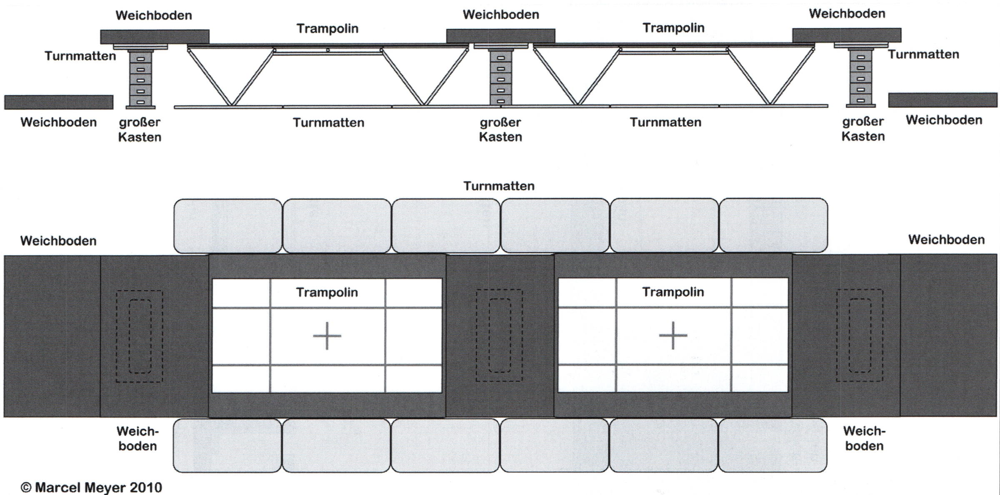
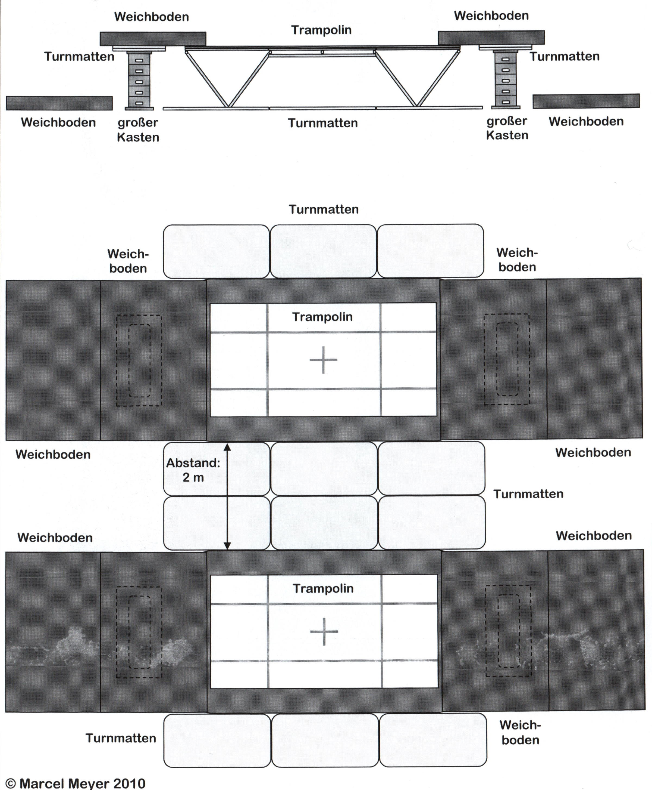

Sicherheit
============

Das Trampolinturnen hat infolge einiger bekannt gewordener Unfälle den Ruf einer sehr gefährlichen Sportart erworben. Diese Sportart ist jedoch genauso gefährlich oder ungefährlich wie andere technische Sportarten, die vom Helfen und Sichern abhängig sind (z.B. Gerätturnen). Dabei sollte jedoch bemerkt werden, dass Unfälle zumeist die Folge von individuellen Fehlern waren/sind und durch die Einhaltung von einigen wenigen Sicherheitshinweisen durchaus vermieden werden können. Diese Sicherheitsaspekte betreffen zum einen den :ref:`Auf- und Abbau des Trampolins <Aufbau>` sowie die äußere :ref:`Organisation der Trainingsstunde <Organisation>`. Daneben muss aber auch insbesondere Wert auf ein den (motorischen) Fähigkeiten des Aktiven angepasstes Trainingsprogramm gelegt werden, was hier vor allem den Bereich des **methodischen Aufbaus** des Trainings und den :ref:`Einsatz von Hilfsmitteln <Hilfestellung>` betrifft.

.. caution::
    Dieser Guide ist nur als Ergänzung zur praktischen Ausbildung gedacht. Gerade beim Sichern lassen sich viele Details nur schwer beschreiben aber relativ leicht zeigen, bzw. beobachten. Zusätzlich lässt sich nicht jeder Punkt abdecken - in diesen Texten liegt der Hauptfokus auf dem Training mit Kindern und Studenten. Daher wird hier kein Anspruch auf Vollständigkeit erhoben.

.. _Aufbau:

Auf- und Abbau des Trampolins
-----------------------------

Besondere Beachtung im Hinblick auf die Sicherheit beim Trampolinturnen muss zu aller erst dem Auf- und Abbau der Geräte geschenkt werden. Durch die Größe der Trampoline bedingt haben die Hersteller ein kompliziertes aber effektives Verfahren entwickelt, ein Trampolin möglichst klein „zusammenzufalten“.

Dieses Verfahren muss von den Aktiven und Trainern verinnerlicht (sprich **auswendig** gelernt und geübt) werden, um mögliche Gefahren beim Auf- und Abbau eines Trampolins zu minimieren. Dabei steht vor allem die körperliche Unversehrtheit der Aktiven im Vordergrund; nicht ohne Bedeutung ist jedoch auch, dass das Trampolin bei unsachgemäßer Handhabung **erheblichen Schaden** davontragen kann - und so ein Gerät ist nicht billig!

Folgende Hinweise müssen deshalb unbedingt beachtet werden:

- die Aktiven müssen regelmäßig auf die Gefahren beim Auf- und Abbau hingewiesen werden. Dies gilt insbesondere für Neulinge und Kinder
- der Auf- und Abbau darf **nur unter Aufsicht** erfahrener Lehrkräfte erfolgen
- Mitwirkende sollten feste, geschlossene Turnschuhe tragen

Wichtig ist es, den Auf- und Abbau mit den Aktiven zu üben und immer wieder richtige **organisatorische Hinweise** zu geben. So ist es zum Beispiel sinnvoll, die jüngeren Kinder mit dem „Entsorgen“ der Rollständer oder dem Auslegen der Matten zu beauftragen. Sie können auch die nötigen Kästen oder Barren besorgen. Das Aufklappen sollte den Aktiven überlassen werden, die dazu kräftemäßig in der Lage sind - und auch groß genug sind. Ist dies (beispielsweise bei einer Kindergruppe) nicht möglich, so sollte sich der verantwortliche Übungsleiter nicht scheuen, eventuell anwesende Eltern um Hilfe zu bitten.

.. rubric:: Transport des Trampolins

- beim Transport durch die Halle muss auf eventuell herumliegende Gegenstände oder Bodenfeatures geachtet werden und ein Überfahren vermieden werden
- das Trampolin wird längs bewegt, am besten an beiden Seiten von jeweils einer Person gezogen und geschoben
- am Standort des Trampolins dürfen sich keine Hindernisse unter der Decke befinden (Ringe, tief hängende Lampen)

.. rubric:: Heberollständer benutzen

- manche Geräteräume erfordern ein Ablassen des Trampolins - daher muss das Gerät vor dem Aufbau wieder hochgehebelt werden
- beim Benutzen der Heberollständer immer frontal zu diesen stehen - nicht seitlich dazu.
- **Achtung**: Nur den vorgesehenen T-Griff greifen (größerer Hebel und keine Einklemmgefahr, besonders beim Abbau)
- Zuerst den T-Griff greifen, danach den Sicherungsknopf fassen und herausziehen
- **Synchron** an beiden Heberollständern arbeiten

.. rubric:: Ausklappen der Standfüße

- beim Kippen des Geräts darauf achten, dass die Ketten frei beweglich sind und nirgendwo hängenbleiben
- darauf achten, dass der **innere Standfuß** beim Kippen nicht **unkontrolliert auf den Boden oder Füße der Helfer fällt**. Der Aufprall verbiegt sehr schnell die Aufnahme für die Quergestänge üblicher Eurotramp-Geräte
- Methodik: inneren Standfuß (durchgängig) festhalten, äußeren Standfuß ankippen und inneren Fuß dagegenlehnen, danach mit einer Hebelbewegung das Trampolin aufklappen und beide Füße ablegen und anschließend aufziehen
- bevor die Heberollständer bedient werden, das Trampolin in die Waagerechte bringen um alle vier Ketten einzuhängen; darauf achten, dass die Ketten nicht verdreht sind
- T-Griff greifen, Sicherungsknopf bedienen und Hebel quer legen bis die Ketten gespannt sind
- die Heberollständer sollten in sicherer Entfernung zum Trainingsbereich gelagert werden – am besten im Geräteraum

.. rubric:: Aufklappen der Trampolinflügel

- beim Aufklappen des Trampolins beide Seitenflügel festhalten und nicht fallen lassen
- der zweite Seitenflügel muss kräftig aufgezogen werden, da sich das Trampolintuch beim Aufklappen spannt; auf den letzten Zentimetern ist trotzdem ein Stützen des Seitenflügels notwendig.
- beim Aufklappen sollte möglichst nur je eine Person auf jeder Seite heben. Ansonsten kann es passieren, dass man sich im Weg steht. Des Weiteren ist darauf zu achten, dass keine Gegenstände im Weg liegen, über die man stolpern könnte.
- erst eine Seite komplett mit Hilfe der Fußstützen befestigen - und erst dann mit dem zweiten Flügel fortfahren

.. rubric:: Absicherung der vier Seiten

- die Stirnseiten des Trampolins müssen mit Weichböden bzw. Trampolintischen abgesichert werden; darauf achten, dass die Kästen, Pferde oder Barren in etwa die gleiche Höhe wie das Trampolin haben; eventuelle Höhenunterschiede können mit kleinen Turnmatten ausgeglichen werden
- die Längsseiten des Trampolins mit Bodenmatten und/oder Turnmatten sichern
- vor Benutzen des Trampolins erst den korrekten Aufbau überprüfen; die Fußstützen sollen eingerastet, die Federn mit dem Haken nach unten montiert und die Ketten gespannt sein

.. rubric:: Abbau

Der Abbau ist in vielen Punkte ähnlich zum Aufbau - Unterschiede werden nachfolgend erläutert.

- Umgebung von Matten und anderen Gegenständen befreien damit die Heberollständer nicht hängen bleiben
- Rahmenpolster öffnen!
- beim Zusammenklappen verhindern, dass die Seitenteile herunterfallen; bei der ersten Seite ist zu beachten, dass das Tuch noch unter Spannung steht und sich selbstständig machen kann sobald die Querstützen befreit sind und nicht festgehalten werden
- die Metallbügel der Heberollständer müssen nach oben zeigen
- es reicht aus die Ketten auf der Seite des oben aufliegenden Seitenflügels zu lösen. Dort wird das Standbein angehoben und geschoben
- die Helfer der Gegenseite stellen sich zuerst auf den Standfuß und drücken dann die nahende Trampolinseite herunter
- bevor das Trampolin in den Geräteraum geschoben wird, muss es eventuell heruntergelassen werden (Türhöhe beachten!)

    Platzsparender Aufbau in Reihe

    Aufbau der Trampoline parallel / für Synchron

Wartung
--------

Verschiedene Punkte sollten in regelmäßigen Abständen geprüft werden.

**Tuch**: leichte Abnutzung zeigt sich nach ein paar Jahren durch fusselige Stellen, meist in Nähe des Kreuzes. Bedenklich wird es erst wenn einzelne Bänder nachgeben und durchhängen. Sinnvoll springen lässt sich nicht mehr und das Durchreißen steht kurz bevor. Das Tuch sollte spätestens jetzt ausgetauscht oder repariert werden (der Hersteller kann einzelne Bänder austauschen, was oft begrenzt sinnvoll ist)

**Federn**: Der Satz sollte vollständig und korrekt installiert sein. Die Öffnung der Aufhängung zeigt nach unten und alle Maschen des Tuchs sind eingehängt.

**Rahmen**: Standfüße sollten vollständig und im guten Zustand sein. Bei vielen Geräten von Eurotramp ist die Steckaufnahme der Querträger recht anfällig. Das Rohrstück verbiegt sobald eins der Beine beim Aufbau runterfällt. Schwieriger zu erkennen sind Haarrisse in den umliegenden Schweißnähten. Falls die Querträger über ein Gummiband unter Spannung stehen, so ist auch dies zu prüfen.

**Rahmenpolster**: sollte vollständig und sicher befestigt sein.

**Kettenspannung**: prüfen ob alle vier Ketten gespannt sind, das Trampolin waagerecht steht und die Klappgelenke korrekt öffnen (in einer Linie, keine Wanne, aber auch keine Überdehnung des Gelenks), ansonsten Kettenlänge beispielsweise nach dem Training gelegentlich inkrementell korrigieren.

.. _Organisation:

Organisatorische Maßnahmen beim Training
-----------------------------------------

Auch während der Trainingsstunde sind einige Regeln vom Trainer und den Aktiven zu beachten.

.. rubric:: Hauptregeln

- den **Anweisungen des Trainers** sind Folge zu leisten
- **nichts und niemand befindet sich unter dem Trampolin** oder den Mattentischen, außer es wird abweichendes angeordnet
- **Es springt immer nur eine Person auf dem Trampolin**, außer es wird etwas anderes angeordnet
- **Sicherheit geht vor Sprunghöhe** - bei unerwarteten Ereignissen oder dem Verlassen des roten Quadrats lieber abstoppen
- **neue Sprungelemente** sind vorher **mit dem Trainer abzusprechen**. Dies gilt insbesondere für Sprünge mit Saltorotation sowie Landungen in Bauch- oder Rückenlage.
- **kein Springen vom Trampolin auf den Boden** - vom Trampolin sollte heruntergeklettert werden (Muskeln passen sich der langsamen Bewegung an, es drohen Zerrung oder Faserriss)

.. rubric:: Zum Training

- der Auf- und Abbau darf **nur unter Aufsicht** erfahrener Lehrkräfte erfolgen
- das Training beginnt mit einer Erwärmung. Verspätete Teilnehmer holen diese selbstständig nach
- Erkrankungen der Aktiven, besonders Herz-Lungen-Kreislauf-Probleme oder Anfallsleiden, sollten dem Trainer bekannt sein (Vertrauensbasis wahren) und mit externem Fachpersonal abgeklärt sein.

.. rubric:: Umgang mit dem Trampolin

- die Längsseiten sollten während des Trainings immer von den jeweils nicht aktiven Sportlern abgesichert werden. Diese sollen natürlich entsprechend aufmerksam sein. Im Falle eines Sturzes wird der Aktive nicht aufgefangen, sondern zurück aufs Trampolin befördert / gedrückt
- unter und neben dem Trampolin befinden sich keine Gegenstände (Flaschen o.ä.)
- in der Regel sollte niemand auf den Rahmen oder den Matten an den Stirnseiten (Mattentische) sitzen
- gerade beim Heruntergehen vom Trampolin bleibt leicht mal ein Fuß unter der Abdeckung hängen. Aufmerksam bleiben nach der Übung! Gerade bei freistehenden Geräten kann ein Stolpern ungünstig enden.
- auf dem Trampolin **kein Kaugummi oder Bonbon** im Mund behalten, bzw. allgemein Essen im Mund (Gefahr des Einatmens)
- Hauptblickrichtung ist immer die Stirnseite des Trampolins, daher sind nur Vielfache von halben Schrauben erlaubt
- im Falle eines Sturzes nicht mit den Händen abfangen, sondern versuchen auf den Rücken zu drehen
- Knie sind im Tuch gestreckt (ansonsten Gefahr ab gewissen Sprunghöhen)

.. rubric:: Kleidung

- gesprungen wird **mit Strümpfen oder Turnschläppchen** (nicht barfuß oder in Turnschuhen)
- keine Ketten, Uhren, Festivalbändchen, offene Piercings oder lange Ohrringe beim Training tragen. Das gilt ebenfalls für die Übungsleiter/Trainer
- beim Springen sollten die Aktiven möglichst **enge Kleidung** tragen; die Sporthose sollten über ein festes Bündchen verfügen. Die T-Shirts sollten mehr als Bauchnabel-Länge haben.
- Keine Kapuzen!
- Keine weiten, offenen Taschen!
- weitere ungeeignete Kleidung: Zehensocken, Jeans (Abrieb), Gürtel mit Gürtelschnallen, Kleidung mit Metallteilen wie Reißverschlüssen oder Nieten

Mit diesen Grundregeln sollten die Sportler von der ersten Stunde an vertraut gemacht werden. Für einen möglichst ungefährlichen Stundenablauf ist die Einhaltung dieser Regeln absolut unerlässlich!

.. _Hilfestellung:

Hilfe- und Sicherheitsstellung
------------------------------

Zu den Hilfsmitteln im Trampolinturnen zählt auch die aktive Arbeit des Trainers am Turner, die Sicherheits- und Hilfestellung. Gerade diese Arbeit ist für das **gefahrlose**, aber auch **zügige Erlernen** neuer Sprünge enorm wichtig. Zum einen kann durch richtige Hilfestellung (auch in Verbindung mit der Schiebematte) das Verletzungsrisiko minimiert werden. Zum anderen ist eine Hilfestellung durch einen erfahrenden Trainer dem Schieben der Matte vorzuziehen, da sich die Unterstützung stufenweise gezielt verringern lässt und damit die „Entwöhnung“ für den Aktiven leichter fällt. Gerade bei diesen (für den Aktiven häufig mit Angstgefühlen verbundenen) Übergängen zwischen Matte und Tuch ist eine kompetente Hilfestellung, welche der Springer auch **vertrauen** kann, äußerst wichtig.

Fehlgeschlagene „Versuche“ können durch entsprechende Techniken und entsprechendes Reagieren des Trainers korrigiert und zu einem „glücklichen“ Ende geführt werden. Diese Techniken (z.B. das Fangen, Unterstützung bei sowohl Salto- als auch Schraubenrotationen u.a.) können nur schwer mit Worten beschrieben werden und sind größtenteils Erfahrungswerte, die jedoch zumindest in den Grundbereichen trainiert werden können. Ich empfehle insbesondere für diesen Bereich **erfahrene Trainer** beim Training zu **beobachten** und vor allem die Hilfestellung intensiv an eigenen Sportlern zu üben. Auch hier sollte, um das Prinzip der graduellen Annäherung einzuhalten, mit einfachen Sprüngen begonnen werden.

Üben der Grundlagen
~~~~~~~~~~~~~~~~~~~~

Der Helfende muss sich dem Rhythmus des Aktiven anpassen können, ohne diesen zu behindern (abzustoppen oder zu „schießen“). Manchmal muss während des Springens mitgesprungen werden, im Absprung (auf "drei") muss der Trainer auf jeden Fall sicher im Tuch stehen bleiben. Dazu ein paar kleine Übungsformen:

.. rubric:: Den Einfluss kontrollieren

- zwei Personen stehen jeweils in ihrer Hälfte des Trampolins
- Tipp: für den Anfang eignet sich eine etwa gleichschwere Personen
- der passive Teilnehmer wippt leicht
- die aktive Person steht im Tuch und versucht durch gezielte Kicks ins Tuch das Sprungverhalten der anderen Person zu beeinflussen
- Anfangs kann es leichter sein mit einem nach vorne gestellten aktiven Bein zu arbeiten
- achtet auf die Bewegung des Partners

  - um Energie mitzugeben ist ein Kick kurz vor dem tiefsten Punkt im Tuch (Ende der Abwärtsbewegung) nötig
  - um Energie wegzunehmen erfolgt der Kick kurz nach dem tiefsten Punkt (Start der Aufwärtsbewegung)

- Variation: 3x leicht Höhe mitgeben, 1x stark Höhe nehmen

.. rubric:: Den Einfluss minimieren

- nun ist neutrales Mitspringen (gleichzeitige Landung) bzw. leichtes Mitgeben von Höhe gefordert
- zwei Personen fassen sich an den Händen und versuchen Strecksprünge gleichzeitig auf dem Trampolin auszuführen.
- Variation: hintereinander mit Festhalten an Hüfte oder Schulter
- Variation: Sprünge mit Drehungen
- auf Kommando (in der Regel „eins, zwei, drei“) führt der vorne Stehende einen einfachen Sprung aus (z.B. eine Hocke); der Helfende bleibt dabei mit beiden Füßen fest auf dem Trampolin stehen und verfolgt die Bewegung mit den Armen. Anschließend bei der Landung nicht vergessen einen Teil der Energie aufzunehmen!

.. rubric:: Die Technik perfektionieren

- sobald diese oben genannten Techniken mit einer Person verlässlich funktionieren, kann und sollte mit anderen Gewichtsklassen experimentiert werden
- neutrales Mitspringen ist essentiell damit sich der aktive Springer auf den durchzuführenden Sprung konzentrieren kann
- sucht euch eventuell einen Fixpunkt am aktiven Springer - etwa die Schulter
- durch den Kontakt zum aktiven Springer kann man die Relation leicht manipulieren und eine gleichzeitige Landung erzwingen
- manche Springer neigen dazu ihr Sprungverhalten beim Anzählen zu verändern, dies erfordert Anpassung!

In der finalen Ausführung der Hilfestellung will man seitlich vom Aktiven stehen. Kontakt wird über den **Sandwichgriff** gehalten. Dabei befindet sich ein Arm des Trainers vor dem Bauch des Aktiven und die Hand des anderen Arms stabilisierend am oberen Rücken, in etwa zwischen den Schulterblättern.

Weitere hilfreiche Hilfestellungen werden passend zu den jeweiligen Sprüngen im Kapitel :doc:`grundspruenge` und später vorgestellt. Sie umfassen:

- Klammergriff
- Stempelgriff
- Oberarmdrehgriff mit 1 oder 2 Trainern
- Absicherung mit einem Gürtel (für Kinder)
- eine Hand im Drehgriff am Hosenbund (für Kinder)
- eine Hand am Rücken, die andere an der Schulter
- Longe

Umgang mit Hilfestellungen
~~~~~~~~~~~~~~~~~~~~~~~~~~

Nach der aktiven Hilfe auf dem Gerät erfolgt normalerweise ein stufenweiser Abbau der Hilfestellung. Nach etwa 5 sicheren aufeinanderfolgenden Sprungwiederholungen kann die Sicherung nach eigenem Ermessen reduziert werden. Bitte nicht scheuen einen Schritt zurück zu gehen bei Verschlechterungen. Ein stufenweiser **Abbau der Hilfestellung** kann wie folgt aussehen:

- beginn mit Vollkontakt beim Mitspringen - bereit für jede Art von Fehler, besonders die Landung kann und sollte gesichert sein
- Reduktion auf das Mitgeben von Höhe oder Rotation
- passives Mitspringen und Eingreifen im Ernstfall
- Reinlaufen vom Rahmen aus
- Reinlaufen nur noch auf Verdacht.

Der Trainer steht nach Abbau der **Hilfestellung** im Bestfall nur noch **auf dem Rahmen**:

- während der Ausführung eines Sprunges muss immer Blickkontakt zum Übenden gehalten werden
- direkt nach dem Absprung betritt der Trainer das Tuch und folgt der Bewegung des Aktiven mit schnellen, kleinen Schritten, um bei der Landung direkt neben diesem zu stehen
- **Tipp**: tiefes Stehen bzw. ein niedriger Schwerpunkt auf dem Rahmen ermöglicht schnellere Bewegung. Turnschläppchen helfen für einen sicheren Stand.
- bei der Landung muss der Trainer mit beiden Beinen sicher auf dem Trampolin stehen bleiben und Energie aufnehmen
- jederzeit auf ein abweichendes Verhalten des Übenden gefasst sein (z.B. Absprung vor „3“, Vorwärts- statt Rückwärtssalto)

Abschließend noch ein paar Hinweise beim **Umgang mit den Teilnehmern**:

- Aktive vorher aufklären was man von ihnen erwartet, wie man ihnen hilft, dazu gehört

  - verwendete Hilfestellungen zeigen
  - eventuelles Abstoppen oder Unterstützen von Rotationen abklären

- Auf jeden Fall vor kontakt-intensiven (Salto-) Hilfestellungen fragen ob die Teilnehmer damit einverstanden sind
- der Trainer sollte sich ebenso der Aufgabe gewachsen fühlen (!)
- Anzählen mit **„und, eins, zwei, drei“ immer voll ausführen**, alles andere gleicht einem Abbruch
- für den Aktiven gelten ähnliche Regeln - ein Nicht-Stellen der Arme gleicht einem Abbruch

.. _Schiebematte:

Einsatz der Schiebematte
------------------------

Für das Trampolinturnen sind spezielle Schiebematten aus Schaumstoff entwickelt worden, die das Erlernen neuer (und komplizierter) Bewegungen unterstützen und hier besonders Verletzungen verhindern sollen. Dabei ist jedoch wichtig zu wissen, dass diese Schiebematten **keinesfalls** in allen Fällen der **„Lebensretter“** sein können, sondern dass das Hauptaugenmerk immer noch auf ein konsequent methodisch aufgebautes Trainingsprogramm gelegt werden sollte. Das bedeutet für die Praxis, dass schwierige Bewegungen, *„weil die Schiebematte ja da ist“*, nicht einfach ausprobiert werden dürfen. Das kann bei fehlgeschlagenen Versuchen neben Verletzungen auch das Entstehen von Angst vor dieser Bewegung beim Aktiven fördern (und damit das Erlernen dieser Bewegung erheblich verlangsamen). Ein entsprechender Grundstock von Bewegungserfahrungen auf dem Trampolin ist auch bei Einsatz der Schiebematte unerlässlich.

Wichtig ist ebenfalls, dass die Schiebematte eben nur ein **Hilfsmittel** zu Beginn des Erlernens neuer Übungsteile ist und schrittweise wieder entfernt und durch andere adäquate Maßnahmen (Hilfe- bzw. Sicherheitsstellung) ersetzt werden sollte. Dabei darf jedoch nie die Sicherheit des Athleten gefährdet werden.

Später, bei komplizierten Salto-Schrauben-Verbindungen, ist die Schiebematte hilfreich, bestimmte **Teilbewegungen** der Sprünge ungefährlich zu üben. Anders als zum Beispiel bei der Rückenlandung oder dem Salto rückwärts können diese Sprünge in verschiedene Stufen unterteilt werden, so dass man sich mit Hilfe der Schiebematte der gewünschten (End-)Bewegung immer mehr nähert.
