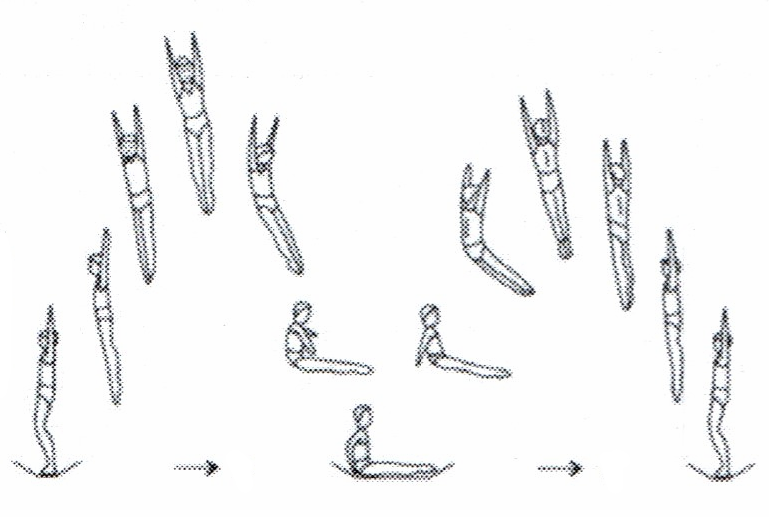

Verbindung von Sprüngen
==========================

In diesem Kapitel wird eine Auswahl an Sprüngen erläutert, die aus den bisherig vorgestellten Bewegungen auf dem Trampolin zusammengesetzt sind und sich im Anschluss an das Erlernen der Grundsprünge anbieten. Das sind anfangs Verbindungen der einzelnen Landungsarten mit Schrauben. Die Aktiven sind hier erstmals mit einer Sprungfolge konfrontiert und müssen lernen den **Fokus auf den aktuellen Sprung** zu legen und nicht bereits an Folgesprünge zu denken. Zusätzlich werden Fehler in der Technik schnell deutlich, da sich die Effekte verschleppen und addieren können.

Hilfestellungen sind in dieser Phase wenig bis kaum nötig und können aus den bereits bekannten Techniken abgeleitet werden. Besonders bei Bauchladungen sollte die Landephase abgesichert sein. Eventuelle Schrauben, inklusive der Richtung, müssen vorher besprochen und beim Sichern bedacht werden.

.. _SitzHalbeStand:

Sitz - ½ Schraube zum Stand
------------------------------

Dieser Klassiker ist vermutlich die am unkompliziertesten zu erlernende Verbindung zweier Sprünge.

    Halbe Schraube in den Sitz & halbe Stand in Phasendarstellung

.. rubric:: Bewegungsbeschreibung

- zum Aufstehen im Sitz drücken sich die Hände vom Tuch ab
- nach der Sitzlandung werden die Arme über die Vorderseite nach oben geführt und die Hüfte getreckt, allerdings:
- um die Schraube einzuleiten **führt der Arme in Schraubenrichtung die Bewegung an** (linker Arm für Schraube linksherum)
- die Schulter des führenden Arms wird bei der Bewegung etwas ausgehoben
- ein schnelles Öffnen des Hüftwinkels ermöglicht eine saubere Schraube in der Hauptachse
- die im :ref:`Abschnitt zu Schrauben <Schrauben>` erwähnte **Hula-Hoop-Bewegung** für leichteres Schrauben lässt sich hier anwenden indem die Hüfte beim Öffnen leicht in Schraubenrichtung gekippt wird
- der Körper bleibt mit gestellten Armen gestreckt bis die halbe Schraube vollendet und die Landung erfolgt

.. rubric:: Methodische Übungsreihe

- die Armbewegung (inklusive Schraube) am Boden demonstrieren und nachahmen lassen
- Demonstration des Sprungs
- Sprung durchführen - erwähnen, dass eine saubere Ausführung wichtiger ist als eine vollendete (halbe) Schraube

.. rubric:: Fehler und Korrekturen

- der Hüftwinkel wird nicht oder zu wenig getreckt; Folge: die Schraube hat zu wenig Rotation oder der Aktive wandert zur Seite
- anstatt die Arme mitzunehmen in Richtung der Drehbewegung, wird versucht sich in der Luft abzudrücken (entgegen der Drehrichtung) und die Schraube bleibt schwach
- Landung in Vorlage -> Hände im Sitz weiter hinten aufsetzen um sich etwas stärker nach vorne abzudrücken

Stand - ½ Schraube zum Sitz
----------------------------

.. rubric:: Bewegungsbeschreibung

- im Absprung Beine (gestreckt) nach **hinten** schieben (analog zum Bauchsprung, aber schwächer), so dass eine leichte Vorlage des gestreckten Körpers im höchsten Punkt erreicht wird
- mit der Schulter eine Drehung in die gewünschte Richtung einleiten
- Arme weiterhin getreckt neben den Ohren halten
- in der 2. Sprungphase (fallende Phase vom oberen Umkehrpunkt bis zur Landung) die Arme seitlich nach unten führen
- kurz vor Tuchkontakt die Sitzposition einnehmen
- siehe Phasendarstellung beim vorherigen Sprung

.. rubric:: Methodische Übungsreihe

- Demonstration des Trainers
- im Stand das Bein auf der Seite der gewünschten Drehrichtung getreckt nach hinten stellen: das andere Bein als Standbein unter dem Körper leicht beugen; Oberkörper vorbeugen, die Arme befinden sich gestreckt neben den Ohren (der Körper ist nun komplett gestreckt); drehen und sich in den Sitz fallen lassen
- aus dem Wippen heraus abspringen, mit dem Zeigefinger einer Hand (Rechte Hand für Schraube nach Links) weit nach vorne in die Luft tippen (das leitet sowohl Vorlage als auch die Schraubenrotation ein)
- aus dem Wippen Beine nach hinten schieben, drehen und im Sitz landen
- Sprunghöhe weiter steigern

.. rubric:: Fehler und Korrekturen

- Beine werden nicht genug oder zu sehr nach hinten geschoben
- die Schraube wird zu früh eingeleitet: erst die Beine schieben
- die Hüfte wird zu früh angewinkelt: schräge Landung durch taumelnde Schraube
- der Kopf bleibt zu lange stehen: Kopf soll sich mit dem gesamten Körper in die gewünschte Drehrichtung bewegen; möglichst früh wieder die Orientierung zum Tuch finden

.. rubric:: Hilfestellung

- der Trainer/Helfende steht auf der Drehrichtung entgegengesetzten Seite des Aktiven und fasst von hinten die Hüften; in der Luft wird die Drehung an der Hüfte unterstützt

Sitz - ½ Schraube zum Sitz
-----------------------------

Technisch ist der Sprung eng verwandt mit der :ref:`½ Schraube zum Stand <SitzHalbeStand>`

.. figure:: ../media/sprung_sitz_halbe_sitz.jpg
    :width: 400px
    :name: fig:sitz_halbe_sitz
    :alt: Sitz - halbe Schraube in den Sitz in Phasendarstellung

    Sitz - halbe Schraube in den Sitz in Phasendarstellung, Quelle: http://heiny.info/uni/sport/phasentrampolin.html

.. rubric:: Bewegungsbeschreibung

- nach der bekannten Sitzlandung drückt sich der Springer kräftig mit den Händen ab
- die Hüfte wird gestreckt und die Beine nach hinten geschoben (analog zu ½ Schraube zum Sitz)
- die Arme bewegen sich wie bei "Sitz, ½ Schraube Stand" versetzt (hier etwas schneller) nach oben um eine Schraube einzuleiten, diesmal stoppen sie allerdings nicht oben, sondern werden wie bei einem Armkreis weitergeführt (für den Springer sind die Arme allerdings Vorne - Oben - Vorne - wie bei einer La-Ola-Welle, nur mit Schraube)
- die Landung erfolgt wie beim Sitzsprung (leicht zurückgelehnt)

.. rubric:: Methodische Übungsreihe

- Armbewegung trocken im Stand üben
- Bewegung in zwei Sprünge teilen: halbe Stand (mit kurzem flüchtigen Stand), halbe Sitz
- Sitz ½ Schraube zum Stand bewusst beschleunigen und etwas mehr Vorlage in der ersten Phase verpassen um den anschließenden Sitz leicht zurückgelehnt zu ermöglichen, dann
- wenn die halbe Schraube in den Stand schnell genug ist, kommt der anschließende Sitz oft von allein

.. rubric:: Fehler und Korrekturen

- der Oberkörper kippt zu früh nach vorne: flacher Sprung und zu schwache Schraube
- der Oberkörper kippt nicht nach vorne; die Beine können nicht nach hinten geschoben werden: auch hier leidet die Schraubenrotation darunter und der folgende Sitz ist vorgelehnt, eventuell die Arme weiter hinten aufsetzen
- der Aktive bleibt im Sitz und rotiert mit Hüftwinkel trotzdem -> zurück zum normalen Sprung in den Stand oder halbe Stand und eventuell Sprunghöhe erhöhen
- Angst vor dem Tuch führt zu angehockten Beinen in der Luft; Gegen die Angst kann jemand mit Erfahrung zeigen wie ein zu flacher Sprung endet: im Stand

Weiterführung
--------------

Die beschriebenen Sitz-Schraubverbindungen lassen sich nun analog auf den Rücken- und Bauchsprung übertragen. Zusätzlich können Verbindungen zwischen den Landeformen geschaffen werden.

- Stand - ½ (Schraube zum) Sitz - ½ Sitz - ...
- Stand - Rücken - ½ Schraube Stand
- Stand - ½ Schraube in den Rücken
- Stand - Sitz - Bauch
- Stand - Bauch - Rücken
- Stand - ½ Schraube Bauch
- Stand - Bauch - ½ Schraube Stand
